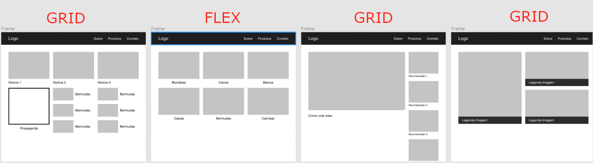
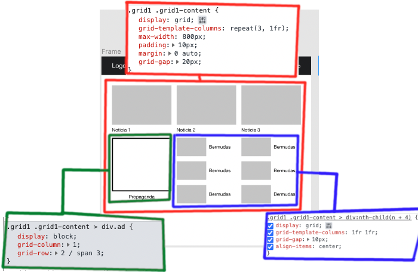
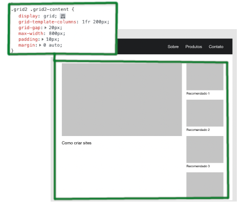
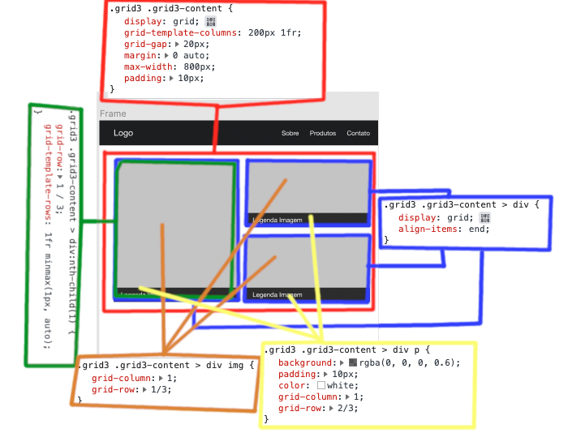

# Grid or Flexbox

- Foi feito um exemplo utilizando alguns tipos comuns de layouts:

---

## Grid 1

- Para o primeiro grid foi estilizado dessa forma:

---

## Grid 2

- Para o segundo grid foi estilizado dessa forma:

---

## Grid 3

- Para o terceiro grid foi estilizado dessa forma:

- Foi necessário um pouco mais de código
